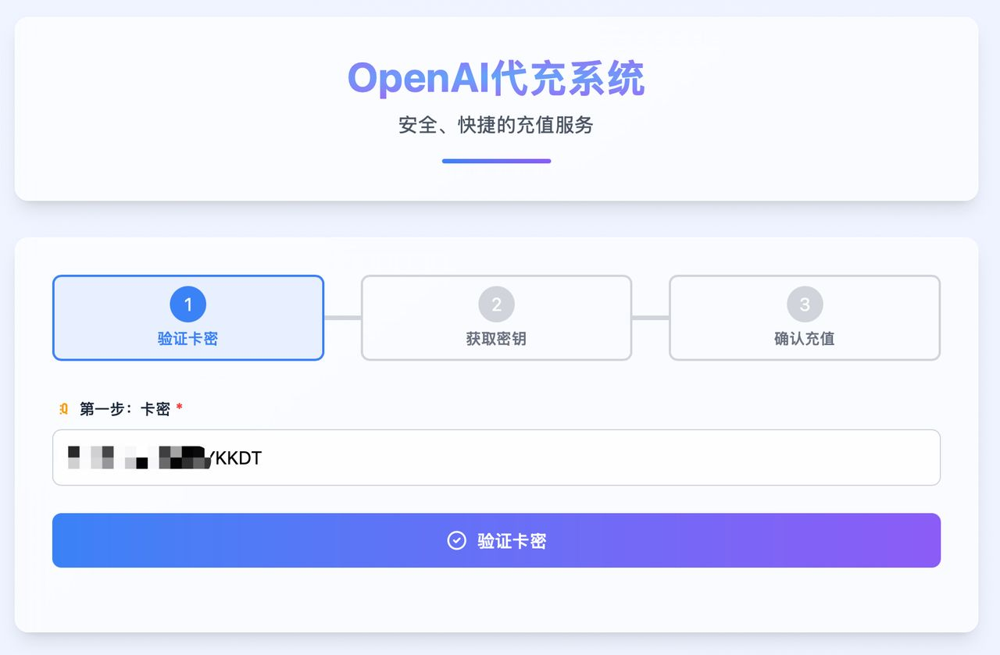
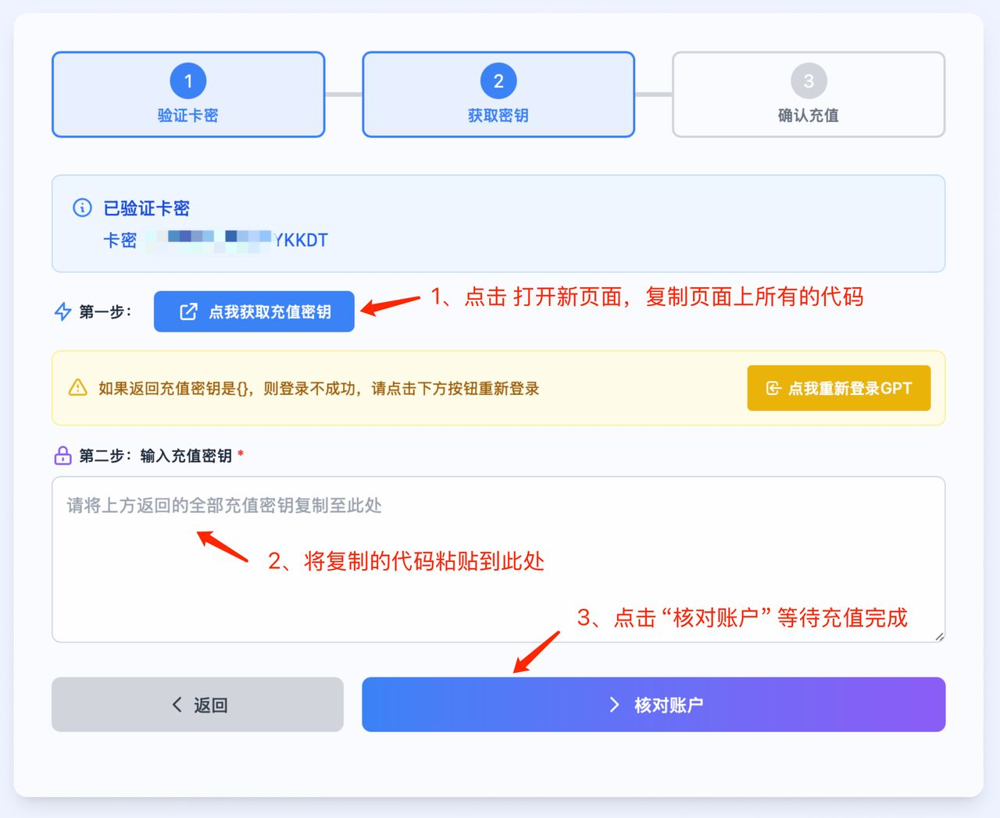
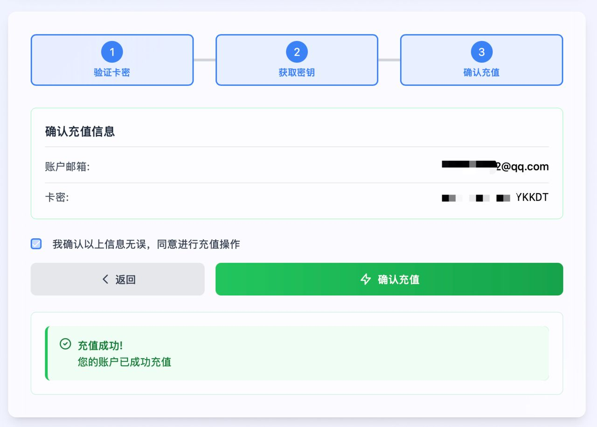
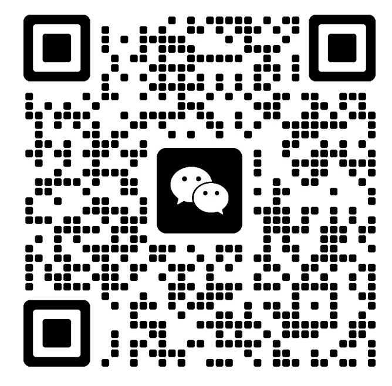

# chatgpt-plus-pro

### 2026 년 가장 손쉬운 ChatGPT Plus 결제 가이드

[简体中文](./README.md) · [English](./README.en.md) · [日本語](./README.ja.md) · **[한국어](./README.ko.md)**

> SSL 암호화 통신, 전 과정 셀프서비스, 신용카드 불필요, 카드 키만으로 30 초 완료.

📅 **업데이트: 2026-05-15** · 상태: **실측 동작 확인**
🔗 키워드: `chatgpt-plus-pro` · `ChatGPT Plus 결제` · `Claude Pro 업그레이드` · `카드 없이`

---

## 목차

- [1. 배경: 왜 ChatGPT Plus 결제가 어려운가](#1-background)
- [2. 주요 업그레이드 방법 비교](#2-comparison)
- [3. 추천: `chatgpt-plus-pro` 대행](#3-recommended)
- [4. 자세한 절차 (약 30초)](#4-tutorial)
- [5. FAQ](#5-faq)

---

## 1. 배경

OpenAI 의 **ChatGPT Plus** (월 $20) 는 현재 가장 널리 사용되는 AI 구독이지만, 중국 본토를 비롯한 일부 지역 사용자는 다음 세 가지 장벽을 만납니다.

1. **결제 제한** — OpenAI 는 Visa / MasterCard 등 해외 발급 카드만 허용하며 청구지 주소도 엄격하게 검증합니다.
2. **가상카드의 리스크 컨트롤 강화** — Depay / OneKey Card / WildCard 등의 **성공률이 지속적으로 하락** 중입니다.
3. **공유 / 카풀 계정의 불안정성** — 환불 분쟁이나 로그인 충돌로 **언제든 강퇴될 수 있고**, 개인 데이터가 타인과 섞이게 됩니다.

2026 년 기준 안정적으로 동작하는 방법은 **본인 명의 해외 카드 보유**, 또는 **본인 계정에 직접 업그레이드해 주는 대행 서비스 이용**, 둘 중 하나입니다.

---

## 2. 주요 업그레이드 방법 비교

| 방법 | 해외 카드 필요 | 성공률 | 정지 위험 | 본인 계정 | 종합 |
| --- | :---: | :---: | :---: | :---: | :---: |
| 공식 신용카드 | ✅ 필요 | 높음 | 낮음 | ✅ | ★★★★☆ |
| 가상카드 | ⚠️ 일부 | 중간 (하락 중) | 중간 | ✅ | ★★☆☆☆ |
| 공유 / 카풀 계정 | ❌ | 높음 | 높음 (강퇴) | ❌ | ★☆☆☆☆ |
| **제3자 대행 (`chatgpt-plus-pro`)** | ❌ | 높음 (≈99.9%) | 낮음 (로그인 없음) | ✅ | ★★★★★ |

> **진입 장벽·성공률·계정 소유권·장기 안정성** 을 종합하면, 해외 카드가 없는 대부분의 사용자에게 제3자 대행이 가장 합리적인 선택입니다.

---

## 3. 추천: `chatgpt-plus-pro` 대행

`chatgpt-plus-pro` 는 极品小店 (<https://plus.jipin.ai>) 에서 운영하는 ChatGPT Plus 직접 충전 서비스이며, "공유 계정" 과는 완전히 다릅니다.

- 🔐 **본인 계정에 충전** — 로그인 가능한 OpenAI 가입 메일만 입력하면 됩니다. **비밀번호는 기기에서 나가지 않습니다.**
- 💳 **Alipay / USDT 지원** — 해외 카드나 PayPal 이 필요 없으며, 중국 국내 사용자도 바로 주문할 수 있습니다.
- ⚡ **약 30 초 처리** — 결제 후 상위 채널이 자동 호출되며, 주문 상태를 실시간으로 확인할 수 있습니다.
- 🛡️ **결제 기간 전체 보장** — 기간 중 공식 측에서 다운그레이드 등이 발생하면 잔여일 기준 환불 또는 재충전을 받을 수 있습니다.

> 이 서비스는 **"해외 결제 단계만 위임"** 합니다. 계정에 로그인하지 않으므로, 충전 자체로 리스크 컨트롤이 트리거되지 않습니다.

## 4. 자세한 절차 (약 30 초)

### Step 1 — 주문 완료 후 카드 키 인증

주문 페이지를 열고 **ChatGPT Plus** 를 선택해 결제하면, 주문 화면에 **충전 카드 키** 가 표시됩니다. 그것을 복사한 뒤 충전 페이지에 붙여넣고 **"카드 키 인증"** 을 클릭합니다.

### Step 2

> ⚠️ **비밀번호 / 2FA 코드 / 복구 메일** 을 요구하는 "상담원" 은 사기입니다. 정상적인 대행은 **메일만으로** 끝납니다.

### Step 3

---

## 5. FAQ

<b>Q1. 공유 / 카풀 계정인가요? 강퇴될 수 있나요?</b>

아닙니다. 대행은 **본인 계정** 에 적용되며, 비밀번호와 관리 권한은 끝까지 사용자에게 있습니다. 공유도 없고, 강퇴도 없습니다.

<b>Q2. 해외 신용카드가 없어도 사용할 수 있나요?</b>

예. `chatgpt-plus-pro` 는 **Alipay / USDT** 를 지원하며 Visa / MasterCard / Apple ID / PayPal 가 필요 없습니다.

<b>Q3. 반영 시간은?</b>

대개 **30 초 이내**. 상위 큐가 혼잡한 경우 5〜30 분이 걸릴 수 있습니다.

<b>Q4. 계정이 정지될 위험은 없나요?</b>

대행 흐름은 **계정 로그인을 하지 않습니다**. 따라서 충전 자체가 정지 원인이 되지 않습니다. 다만 계정 측 약관 위반 (봇 사용, 남용, 공유 등) 은 별도 사안입니다.

---

### 문의

- 🛒 **주문 페이지 (권장)**: <https://plus.jipin.ai> (极品小店 / Jipin Store)
- 💬 **WeChat 고객센터**: 아래 QR 코드

> 먼저 연락하여 **비밀번호** 를 요구하는 사람은 본 프로젝트와 무관합니다.

---

이 가이드가 도움이 되었다면 **Star ⭐ / Fork 🍴** 부탁드립니다. 더 많은 사람이 `chatgpt-plus-pro` 를 찾을 수 있습니다.

